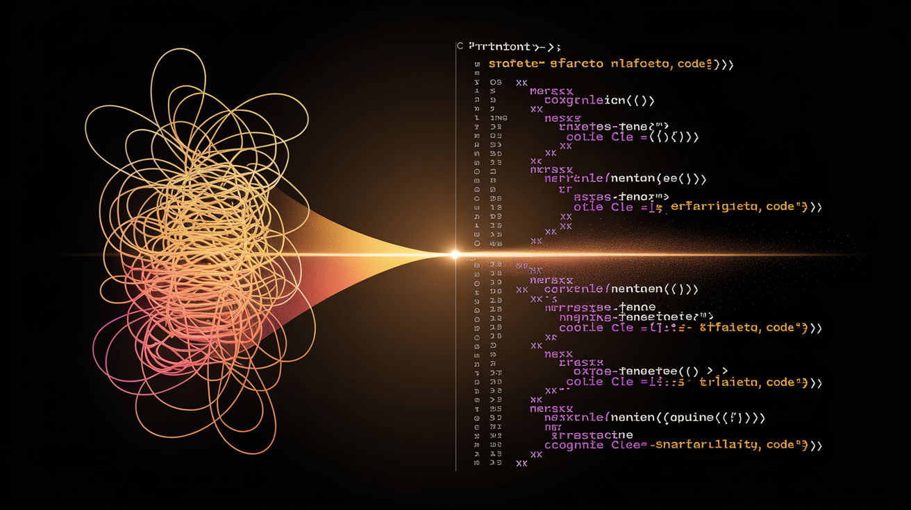

<div align="center">



# ⚡ CleanCode
### *Next-Generation Multi-Model AI Code Analysis, Audit & Enhancement Engine*

[](https://python.org)
[](https://opensource.org/licenses/MIT)
[](https://ollama.com)
[](./vscode-extension)
[](https://jtgsystems.com)

**CleanCode** is an enterprise-grade static and semantic code intelligence platform. It orchestrates local LLMs (via Ollama) and leading cloud reasoning models (OpenAI, Claude, Groq, Gemini) to detect security vulnerabilities, logic defects, algorithmic bottlenecks, and architectural debt before code reaches production.

[Features](#-key-features) • [Architecture](#-architecture) • [Quickstart](#-quickstart) • [CLI & GUI Usage](#-usage-modes) • [VS Code Extension](#-vs-code-extension) • [Model Matrix](#-supported-ai-models) • [Sponsorship](#-created-by-jtg-systems)

</div>

---

## 🚀 Key Features

| Capability | Description | Supported Backends |
| :--- | :--- | :--- |
| **🛡️ Deep Security Audits** | Detects CWE/OWASP vulnerabilities, unsanitized subprocess calls, path traversals, and secret leaks. | AST + LLM Ensemble |
| **⚡ Performance Profiling** | Identifies $O(N^2)$ scalar bottlenecks, unmemoized loops, blocking I/O, and heavy memory allocations. | Multi-Pass Heuristics |
| **🧠 Multi-Model Consensus** | Runs concurrent evaluations across local & cloud models to eliminate hallucinations and pinpoint true defects. | Ollama, Claude, OpenAI, Groq, Gemini |
| **💻 Interactive GUI** | Native Tkinter-based workbench with side-by-side diffing, real-time remediation, and report exporting. | Tkinter / Desktop GUI |
| **⌨️ High-Throughput CLI** | Fast batch scanning, CI/CD pipeline integration, JSON/Markdown reporting, and AST filtering. | Python CLI (`enhancer`) |
| **🔌 VS Code Extension** | Live inline diagnostics, problem markers, and automated refactoring actions directly inside your IDE. | VS Code LSP & Extension |

---

## 🏛️ Architecture

```
                                  ┌───────────────────────────┐
                                  │   Input: Source Code      │
                                  │ (Python, Scripts, Repos)  │
                                  └─────────────┬─────────────┘
                                                │
                                  ┌─────────────▼─────────────┐
                                  │  Path & Syntax Validation │
                                  │  (AST Parser & Encoding)  │
                                  └─────────────┬─────────────┘
                                                │
                 ┌──────────────────────────────┴──────────────────────────────┐
                 │                                                             │
   ┌─────────────▼─────────────┐                                 ┌─────────────▼─────────────┐
   │    Local Models (Ollama)   │                                 │   Cloud Providers (APIs)  │
   │  • DeepSeek-R1 / Coder    │                                 │  • Claude 3.7 / 3.5       │
   │  • Qwen 2.5 Coder 32B/7B  │                                 │  • GPT-4o / o1            │
   │  • Codestral 22B          │                                 │  • Groq Llama 3.3 70B     │
   │  • Phi-4 / Llama 3.3      │                                 │  • Google Gemini 2.5 Pro  │
   └─────────────┬─────────────┘                                 └─────────────┬─────────────┘
                 │                                                             │
                 └──────────────────────────────┬──────────────────────────────┘
                                                │
                                  ┌─────────────▼─────────────┐
                                  │  Consensus & Remediation  │
                                  │   Engine (ENHANCER.core)  │
                                  └─────────────┬─────────────┘
                                                │
         ┌──────────────────────────────────────┼──────────────────────────────────────┐
         │                                      │                                      │
┌────────▼────────┐                   ┌─────────▼─────────┐                  ┌─────────▼─────────┐
│ Interactive GUI │                   │ High-Speed CLI    │                  │ VS Code Extension │
│ (Diff & Apply)  │                   │ (CI / JSON Audit) │                  │ (Inline Markers)  │
└─────────────────┘                   └───────────────────┘                  └───────────────────┘
```

---

## 📦 Quickstart

### 1. Prerequisites
* **Python**: 3.9 or higher
* **Ollama (Optional for local inference)**: [ollama.ai](https://ollama.ai/)
* **Git**: Installed and configured

### 2. Installation
```bash
# Clone the repository
git clone https://github.com/jtgsystems/CleanCode.git
cd CleanCode

# Install in editable mode with development dependencies
pip install -e ".[dev]"
```

### 3. Setup Environment (Optional for Cloud Models)
Create a `.env` file or export your API keys:
```bash
export GROQ_API_KEY="gsk_..."
export ANTHROPIC_API_KEY="sk-ant-..."
export OPENAI_API_KEY="sk-proj-..."
export GOOGLE_API_KEY="AIza..."
```

### 4. Local Model Setup (Ollama)
Ensure Ollama is running, then pull recommended models:
```bash
# Pull high-accuracy coding & reasoning models
ollama pull qwen2.5-coder:latest
ollama pull codestral:latest
ollama pull deepseek-r1:latest
```

---

## 🖥️ Usage Modes

### 🎨 1. Interactive GUI Mode
Launch the graphical workbench to browse files, run multi-model audits, compare before/after diffs, and apply fixes interactively:
```bash
enhancer-gui
# or
python -m ENHANCER.gui
```

---

### ⚡ 2. Command Line Interface (CLI)

#### Analyze a Single File
```bash
enhancer analyze path/to/script.py
```

#### Analyze an Entire Directory with a Specific Model
```bash
enhancer analyze ./src --model qwen2.5-coder:latest
```

#### Generate Automated Improvement Suggestions
```bash
enhancer suggest path/to/module.py --output ./reports/
```

#### Batch Audit with Custom Timeout
```bash
enhancer analyze ./lib --timeout 120 --export-json audit-results.json
```

---

## 🔌 VS Code Extension

CleanCode includes a dedicated VS Code extension located in [`vscode-extension/`](./vscode-extension) for real-time analysis directly in the editor.

### Features:
* 🩺 **On-Save & On-Type Diagnostics**: Highlights code smells, complexity spikes, and security flaws in the Problems panel.
* 💡 **Code Actions & Quick Fixes**: Apply AI-suggested refactorings with a single click (`Ctrl+.` / `Cmd+.`).
* 📊 **Live Quality Metrics**: Real-time status bar telemetry on cyclomatic complexity and maintainability index.

### Extension Setup:
```bash
cd vscode-extension
npm install
npm run compile
# Package into .vsix or launch in VS Code debug mode
npm run package
```

---

## 🤖 Supported AI Models

CleanCode natively supports over 30+ local and cloud model architectures:

### Local Models (via Ollama)
* `qwen2.5-coder` (7B, 14B, 32B) — State-of-the-art open coding model
* `codestral` (22B) — Mistral AI's specialized code engine
* `deepseek-r1` / `deepseek-coder` — Reasoning & chain-of-thought code verification
* `phi4` — Microsoft high-density reasoning model
* `llama3.3` / `llama3.2` — Meta's versatile instruction models
* `command-r7b` — Cohere's efficient enterprise model

### Cloud Reasoning APIs
* **Anthropic**: `claude-3-7-sonnet`, `claude-3-5-sonnet`
* **OpenAI**: `gpt-4o`, `o1`, `o3-mini`
* **Groq**: Ultra-low-latency `llama-3.3-70b-versatile`, `mixtral-8x7b`
* **Google**: `gemini-2.5-pro`, `gemini-2.5-flash`

---

## 🧪 Testing & Verification

CleanCode enforces strict quality and behavioral testing:

```bash
# Run test suite
pytest tests/ -v

# Run analyzer validation test
python test_analyzer.py

# Check Ollama connectivity & GPU status
python check_ollama.py
```

---

## 📄 License

This project is licensed under the **MIT License** — see the [LICENSE](LICENSE) file for details.

---

## 🏆 Created by JTG Systems

<div align="center">

<a href="https://jtgsystems.com">
  
</a>

**Engineered with pride by [JTG Systems](https://jtgsystems.com)**  
*Enterprise Systems Architecture, Custom Workstations & AI Solutions*

🌐 **Website**: [jtgsystems.com](https://jtgsystems.com)  
📞 **Contact / Support**: (905) 892-4555  
☕ **Tips & Sponsorship**: `jtgsystems@gmail.com`

</div>
